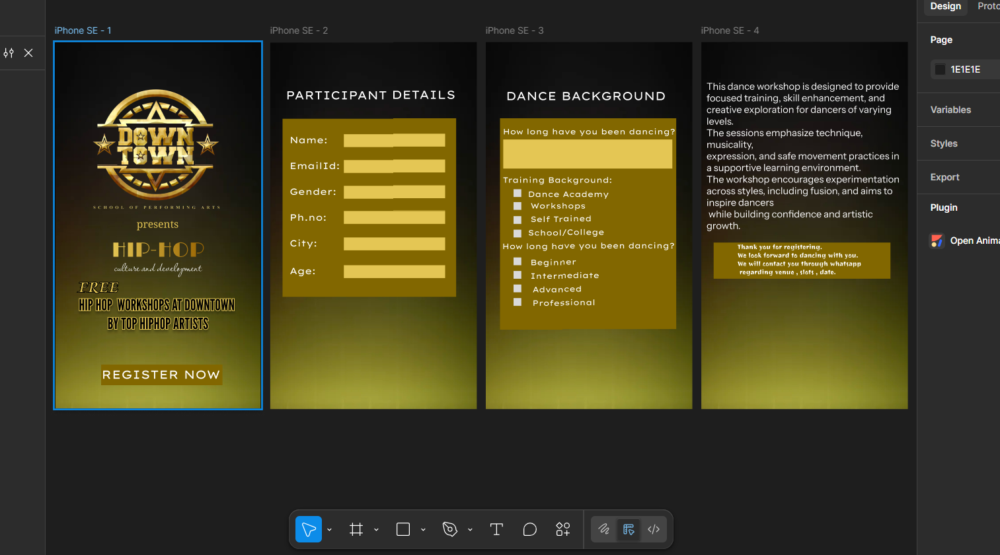
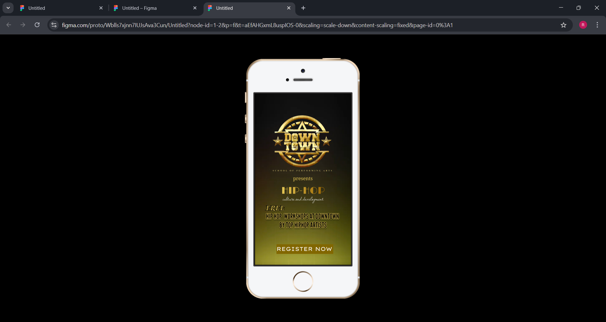
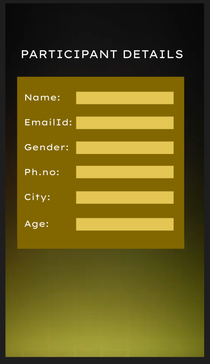
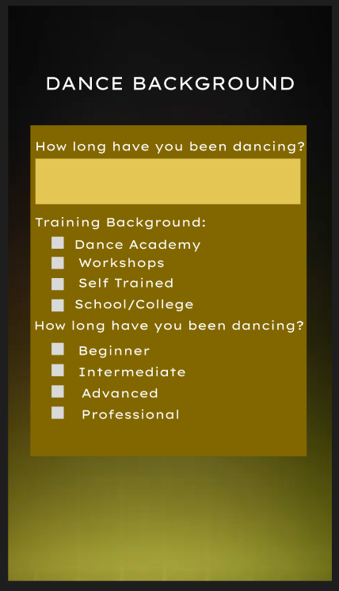
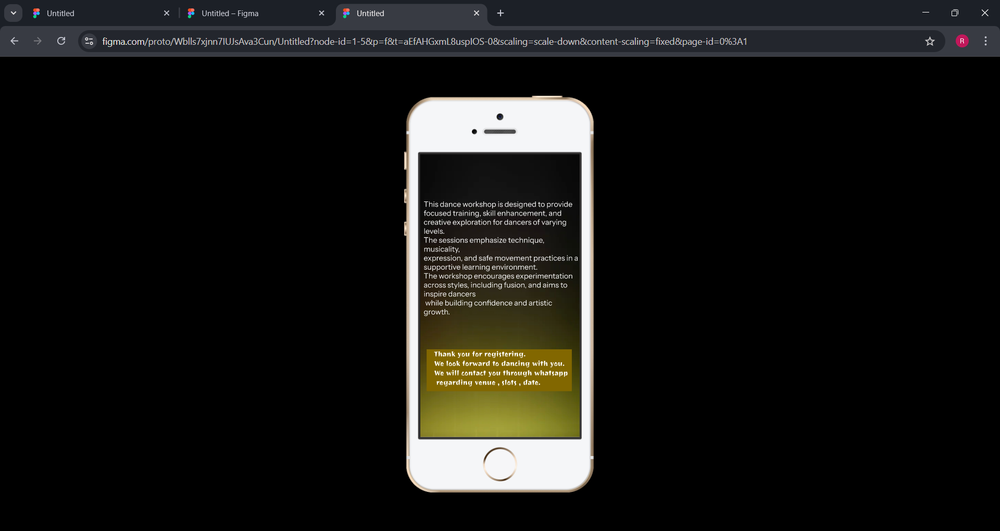

# Ex08 Event Registration Web Application
# Date:16-12-25
# AIM:
To design, develop and deploy a web application for event registration.

# DESIGN STEPS:
## Step 1:
Create a new frame.

## Step 2:
Select any one preset size of your choice.

## Step 3:
Select the shapes you need.

## Step 4:
Import images as needed.

## Step 5:
Create pages based on your need and link them.

## Step 6:
Validate the HTML and CSS code.

## Step 6:
Publish the website in the given URL.

# DESIGN TOOL:
Figma

# CODE:
index.html
```
<!DOCTYPE html>
<html>
  <head>
    <meta name="viewport" content="width=device-width, initial-scale=1" />
    <meta charset="utf-8" />
    <link rel="stylesheet" href="globals.css" />
    <link rel="stylesheet" href="style.css" />
  </head>
  <body>
    <div class="iphone-SE">
      
      <div class="text-wrapper">HIP-HOP</div>
      
      <div class="div">presents</div>
      <div class="text-wrapper-2">culture and development</div>
      <p class="HIP-HOP-WORKSHOPS-AT">HIP HOP&nbsp;&nbsp;WORKSHOPS AT DOWNTOWN <br />BY TOP HIPHOP ARTISTS</p>
      <div class="rectangle-2"></div>
      <div class="text-wrapper-3">REGISTER NOW</div>
      <div class="text-wrapper-4">FREE</div>
    </div>
  </body>
</html>


<!DOCTYPE html>
<html>
  <head>
    <meta name="viewport" content="width=device-width, initial-scale=1" />
    <meta charset="utf-8" />
    <link rel="stylesheet" href="globals.css" />
    <link rel="stylesheet" href="style.css" />
  </head>
  <body>
    <div class="iphone-SE">
      
      <div class="rectangle"></div>
      <div class="text-wrapper">PARTICIPANT DETAILS</div>
      <div class="div">Name:</div>
      <div class="text-wrapper-2">Gender:</div>
      <div class="text-wrapper-2">Gender:</div>
      <div class="text-wrapper-3">Ph.no:</div>
      <div class="text-wrapper-4">City:</div>
      <div class="text-wrapper-5">Age:</div>
      <div class="text-wrapper-6">EmailId:</div>
      <div class="rectangle-2"></div>
      <div class="rectangle-3"></div>
      <div class="rectangle-4"></div>
      
      
      
    </div>
  </body>
</html>


<!DOCTYPE html>
<html>
  <head>
    <meta name="viewport" content="width=device-width, initial-scale=1" />
    <meta charset="utf-8" />
    <link rel="stylesheet" href="globals.css" />
    <link rel="stylesheet" href="style.css" />
  </head>
  <body>
    <div class="iphone-SE">
      
      <div class="text-wrapper">DANCE BACKGROUND</div>
      <div class="rectangle"></div>
      <div class="div"></div>
      <p class="p">How long have you been dancing?</p>
      <p class="text-wrapper-2">How long have you been dancing?</p>
      <div class="text-wrapper-3">Training Background:</div>
      <div class="text-wrapper-4">Dance Academy</div>
      <div class="text-wrapper-5">Beginner</div>
      <div class="text-wrapper-6">Intermediate</div>
      <div class="text-wrapper-7">Advanced</div>
      <div class="text-wrapper-8">Professional</div>
      <div class="text-wrapper-9">Workshops</div>
      <div class="text-wrapper-10">Self Trained</div>
      <div class="text-wrapper-11">School/College</div>
      <div class="rectangle-2"></div>
      <div class="rectangle-3"></div>
      <div class="rectangle-4"></div>
      <div class="rectangle-5"></div>
      <div class="rectangle-6"></div>
      <div class="rectangle-7"></div>
      <div class="rectangle-8"></div>
      <div class="rectangle-9"></div>
      <div class="rectangle-10"></div>
    </div>
  </body>
</html>

<!DOCTYPE html>
<html>
  <head>
    <meta name="viewport" content="width=device-width, initial-scale=1" />
    <meta charset="utf-8" />
    <link rel="stylesheet" href="globals.css" />
    <link rel="stylesheet" href="style.css" />
  </head>
  <body>
    <div class="iphone-SE">
      <div class="rectangle"></div>
      
      <div class="div"></div>
      <p class="thank-you-for">
        Thank you for registering. <br />We look forward to dancing with you. <br />We will contact you through
        whatsapp<br />
        regarding venue , slots , date.
      </p>
    </div>
  </body>
</html>

```
style.css
```
.iphone-SE {
  background-color: #ffffff;
  overflow: hidden;
  border: 1px solid;
  border-color: #000000;
  width: 100%;
  min-width: 320px;
  min-height: 568px;
  position: relative;
}

.iphone-SE .web-photo-editor {
  position: absolute;
  top: 0;
  left: 0;
  width: 320px;
  height: 568px;
  aspect-ratio: 0.56;
  object-fit: cover;
}

.iphone-SE .text-wrapper {
  position: absolute;
  top: 303px;
  left: 88px;
  background: linear-gradient(
    90deg,
    rgba(228, 198, 84, 1) 0%,
    rgba(153, 100, 1, 1) 100%
  );
  -webkit-background-clip: text !important;
  background-clip: text;
  -webkit-text-fill-color: transparent;
  text-fill-color: transparent;
  font-family: "Limelight-Regular", Helvetica;
  font-weight: 400;
  color: transparent;
  font-size: 32px;
  text-align: center;
  letter-spacing: 0;
  line-height: normal;
}

.iphone-SE .rectangle {
  position: absolute;
  top: 69px;
  left: 48px;
  width: 218px;
  height: 218px;
  aspect-ratio: 1;
  object-fit: cover;
}

.iphone-SE .div {
  position: absolute;
  top: 271px;
  left: 127px;
  width: 149px;
  font-family: "Koh Santepheap-Regular", Helvetica;
  font-weight: 400;
  color: #e4c654;
  font-size: 16px;
  letter-spacing: 0;
  line-height: normal;
}

.iphone-SE .text-wrapper-2 {
  position: absolute;
  top: 332px;
  left: 54px;
  width: 212px;
  font-family: "Lavishly Yours-Regular", Helvetica;
  font-weight: 400;
  color: #ffffff;
  font-size: 20px;
  text-align: center;
  letter-spacing: 0;
  line-height: normal;
}

.iphone-SE .HIP-HOP-WORKSHOPS-AT {
  position: absolute;
  top: 391px;
  left: -7px;
  width: 332px;
  text-shadow: 0px 4px 4px #00000040;
  -webkit-text-stroke: 1px #e4c654;
  font-family: "League Gothic-Regular", Helvetica;
  font-weight: 400;
  color: #000000;
  font-size: 24px;
  text-align: center;
  letter-spacing: 0;
  line-height: normal;
}

.iphone-SE .rectangle-2 {
  position: absolute;
  top: 499px;
  left: 72px;
  width: 188px;
  height: 32px;
  background-color: #816600;
}

.iphone-SE .text-wrapper-3 {
  position: absolute;
  top: 503px;
  left: 72px;
  font-family: "Lexend Mega-Regular", Helvetica;
  font-weight: 400;
  color: #ffffff;
  font-size: 18px;
  text-align: center;
  letter-spacing: 0;
  line-height: normal;
}

.iphone-SE .text-wrapper-4 {
  position: absolute;
  top: 363px;
  left: 34px;
  -webkit-text-stroke: 1px #000000;
  font-family: "Kings-Regular", Helvetica;
  font-weight: 400;
  color: #e4c654;
  font-size: 24px;
  text-align: center;
  letter-spacing: 0;
  line-height: normal;
}

.iphone-SE {
  background-color: #ffffff;
  width: 100%;
  min-width: 320px;
  min-height: 568px;
  position: relative;
}

.iphone-SE .web-photo-editor {
  position: absolute;
  top: 0;
  left: 0;
  width: 320px;
  height: 568px;
  aspect-ratio: 0.56;
  object-fit: cover;
}

.iphone-SE .rectangle {
  position: absolute;
  top: 118px;
  left: 19px;
  width: 269px;
  height: 276px;
  background-color: #816600;
}

.iphone-SE .text-wrapper {
  position: absolute;
  top: 70px;
  left: 24px;
  font-family: "Lexend Giga-Regular", Helvetica;
  font-weight: 400;
  color: #ffffff;
  font-size: 18px;
  letter-spacing: 0;
  line-height: normal;
}

.iphone-SE .div {
  position: absolute;
  top: 142px;
  left: 30px;
  font-family: "Lexend Giga-Regular", Helvetica;
  font-weight: 400;
  color: #ffffff;
  font-size: 14px;
  letter-spacing: 0;
  line-height: normal;
}

.iphone-SE .text-wrapper-2 {
  position: absolute;
  top: 222px;
  left: 30px;
  font-family: "Lexend Giga-Regular", Helvetica;
  font-weight: 400;
  color: #ffffff;
  font-size: 14px;
  letter-spacing: 0;
  line-height: normal;
}

.iphone-SE .text-wrapper-3 {
  position: absolute;
  top: 262px;
  left: 30px;
  font-family: "Lexend Giga-Regular", Helvetica;
  font-weight: 400;
  color: #ffffff;
  font-size: 14px;
  letter-spacing: 0;
  line-height: normal;
}

.iphone-SE .text-wrapper-4 {
  position: absolute;
  top: 302px;
  left: 30px;
  font-family: "Lexend Giga-Regular", Helvetica;
  font-weight: 400;
  color: #ffffff;
  font-size: 14px;
  letter-spacing: 0;
  line-height: normal;
}

.iphone-SE .text-wrapper-5 {
  position: absolute;
  top: 345px;
  left: 30px;
  font-family: "Lexend Giga-Regular", Helvetica;
  font-weight: 400;
  color: #ffffff;
  font-size: 14px;
  letter-spacing: 0;
  line-height: normal;
}

.iphone-SE .text-wrapper-6 {
  position: absolute;
  top: 182px;
  left: 30px;
  font-family: "Lexend Giga-Regular", Helvetica;
  font-weight: 400;
  color: #ffffff;
  font-size: 14px;
  letter-spacing: 0;
  line-height: normal;
}

.iphone-SE .rectangle-2 {
  top: 142px;
  background-color: #e4c654;
  position: absolute;
  left: 114px;
  width: 157px;
  height: 20px;
}

.iphone-SE .rectangle-3 {
  top: 182px;
  background-color: #e4c654;
  position: absolute;
  left: 114px;
  width: 157px;
  height: 20px;
}

.iphone-SE .rectangle-4 {
  top: 222px;
  background-color: #e4c654;
  position: absolute;
  left: 114px;
  width: 157px;
  height: 20px;
}

.iphone-SE .img {
  top: 261px;
  position: absolute;
  left: 114px;
  width: 157px;
  height: 20px;
}

.iphone-SE .rectangle-5 {
  top: 302px;
  position: absolute;
  left: 114px;
  width: 157px;
  height: 20px;
}

.iphone-SE .rectangle-6 {
  top: 345px;
  position: absolute;
  left: 114px;
  width: 157px;
  height: 20px;
}


.iphone-SE {
  background-color: #ffffff;
  width: 100%;
  min-width: 320px;
  min-height: 568px;
  position: relative;
}

.iphone-SE .web-photo-editor {
  position: absolute;
  top: 0;
  left: 0;
  width: 320px;
  height: 568px;
  aspect-ratio: 0.56;
  object-fit: cover;
}

.iphone-SE .text-wrapper {
  top: 65px;
  left: 36px;
  font-size: 18px;
  position: absolute;
  font-family: "Lexend Giga-Regular", Helvetica;
  font-weight: 400;
  color: #ffffff;
  letter-spacing: 0;
  line-height: normal;
}

.iphone-SE .rectangle {
  position: absolute;
  top: 118px;
  left: 22px;
  width: 273px;
  height: 323px;
  background-color: #816600;
}

.iphone-SE .div {
  position: absolute;
  top: 122px;
  left: 22px;
  width: 273px;
  height: 323px;
  background-color: #816600;
}

.iphone-SE .p {
  position: absolute;
  top: 131px;
  left: 26px;
  font-family: "Lexend Giga-Regular", Helvetica;
  font-weight: 400;
  color: #ffffff;
  font-size: 12px;
  text-align: center;
  letter-spacing: 0;
  line-height: normal;
}

.iphone-SE .text-wrapper-2 {
  position: absolute;
  top: 308px;
  left: 25px;
  font-family: "Lexend Giga-Regular", Helvetica;
  font-weight: 400;
  color: #ffffff;
  font-size: 12px;
  text-align: center;
  letter-spacing: 0;
  line-height: normal;
}

.iphone-SE .text-wrapper-3 {
  position: absolute;
  top: 206px;
  left: 26px;
  font-family: "Lexend Giga-Regular", Helvetica;
  font-weight: 400;
  color: #ffffff;
  font-size: 12px;
  text-align: center;
  letter-spacing: 0;
  line-height: normal;
}

.iphone-SE .text-wrapper-4 {
  top: 228px;
  left: 65px;
  font-size: 12px;
  text-align: center;
  position: absolute;
  font-family: "Lexend Giga-Regular", Helvetica;
  font-weight: 400;
  color: #ffffff;
  letter-spacing: 0;
  line-height: normal;
}

.iphone-SE .text-wrapper-5 {
  position: absolute;
  top: 333px;
  left: 69px;
  font-family: "Lexend Giga-Regular", Helvetica;
  font-weight: 400;
  color: #ffffff;
  font-size: 12px;
  letter-spacing: 0;
  line-height: normal;
}

.iphone-SE .text-wrapper-6 {
  position: absolute;
  top: 354px;
  left: 69px;
  font-family: "Lexend Giga-Regular", Helvetica;
  font-weight: 400;
  color: #ffffff;
  font-size: 12px;
  text-align: center;
  letter-spacing: 0;
  line-height: normal;
}

.iphone-SE .text-wrapper-7 {
  position: absolute;
  top: 375px;
  left: 72px;
  font-family: "Lexend Giga-Regular", Helvetica;
  font-weight: 400;
  color: #ffffff;
  font-size: 12px;
  text-align: center;
  letter-spacing: 0;
  line-height: normal;
}

.iphone-SE .text-wrapper-8 {
  position: absolute;
  top: 396px;
  left: 72px;
  font-family: "Lexend Giga-Regular", Helvetica;
  font-weight: 400;
  color: #ffffff;
  font-size: 12px;
  text-align: center;
  letter-spacing: 0;
  line-height: normal;
}

.iphone-SE .text-wrapper-9 {
  position: absolute;
  top: 246px;
  left: 69px;
  font-family: "Lexend Giga-Regular", Helvetica;
  font-weight: 400;
  color: #ffffff;
  font-size: 12px;
  text-align: center;
  letter-spacing: 0;
  line-height: normal;
}

.iphone-SE .text-wrapper-10 {
  position: absolute;
  top: 266px;
  left: 69px;
  font-family: "Lexend Giga-Regular", Helvetica;
  font-weight: 400;
  color: #ffffff;
  font-size: 12px;
  text-align: center;
  letter-spacing: 0;
  line-height: normal;
}

.iphone-SE .text-wrapper-11 {
  position: absolute;
  top: 287px;
  left: 65px;
  font-family: "Lexend Giga-Regular", Helvetica;
  font-weight: 400;
  color: #ffffff;
  font-size: 12px;
  text-align: center;
  letter-spacing: 0;
  line-height: normal;
}

.iphone-SE .rectangle-2 {
  position: absolute;
  top: 151px;
  left: 27px;
  width: 262px;
  height: 45px;
  background-color: #e4c654;
}

.iphone-SE .rectangle-3 {
  position: absolute;
  top: 228px;
  left: 43px;
  width: 12px;
  height: 12px;
  background-color: #d9d9d9;
}

.iphone-SE .rectangle-4 {
  position: absolute;
  top: 333px;
  left: 43px;
  width: 12px;
  height: 12px;
  background-color: #d9d9d9;
}

.iphone-SE .rectangle-5 {
  position: absolute;
  top: 354px;
  left: 43px;
  width: 12px;
  height: 12px;
  background-color: #d9d9d9;
}

.iphone-SE .rectangle-6 {
  position: absolute;
  top: 375px;
  left: 43px;
  width: 12px;
  height: 12px;
  background-color: #d9d9d9;
}

.iphone-SE .rectangle-7 {
  position: absolute;
  top: 396px;
  left: 43px;
  width: 12px;
  height: 12px;
  background-color: #d9d9d9;
}

.iphone-SE .rectangle-8 {
  position: absolute;
  top: 248px;
  left: 43px;
  width: 12px;
  height: 12px;
  background-color: #d9d9d9;
}

.iphone-SE .rectangle-9 {
  position: absolute;
  top: 269px;
  left: 43px;
  width: 12px;
  height: 12px;
  background-color: #d9d9d9;
}

.iphone-SE .rectangle-10 {
  position: absolute;
  top: 290px;
  left: 43px;
  width: 12px;
  height: 12px;
  background-color: #d9d9d9;
}

.iphone-SE {
  background-color: #ffffff;
  overflow: hidden;
  width: 100%;
  min-width: 320px;
  min-height: 568px;
  position: relative;
}

.iphone-SE .rectangle {
  position: absolute;
  top: 382px;
  left: 8px;
  width: 296px;
  height: 66px;
  background-color: #d9d9d9;
}

.iphone-SE .web-photo-editor {
  position: absolute;
  top: 0;
  left: 0;
  width: 320px;
  height: 568px;
  aspect-ratio: 0.56;
  object-fit: cover;
}

.iphone-SE .div {
  position: absolute;
  top: 392px;
  left: 13px;
  width: 291px;
  height: 84px;
  background-color: #816600;
}

.iphone-SE .thank-you-for {
  position: absolute;
  top: 392px;
  left: 28px;
  width: 466px;
  font-family: "Joti One-Regular", Helvetica;
  font-weight: 400;
  color: #ffffff;
  font-size: 14px;
  letter-spacing: 0;
  line-height: normal;
}

```

global.html
```
@import url("https://cdnjs.cloudflare.com/ajax/libs/meyer-reset/2.0/reset.min.css");
* {
  -webkit-font-smoothing: antialiased;
  box-sizing: border-box;
}
html,
body {
  margin: 0px;
  height: 100%;
}
/* a blue color as a generic focus style */
button:focus-visible {
  outline: 2px solid #4a90e2 !important;
  outline: -webkit-focus-ring-color auto 5px !important;
}
a {
  text-decoration: none;
}

@import url("https://cdnjs.cloudflare.com/ajax/libs/meyer-reset/2.0/reset.min.css");
* {
  -webkit-font-smoothing: antialiased;
  box-sizing: border-box;
}
html,
body {
  margin: 0px;
  height: 100%;
}
/* a blue color as a generic focus style */
button:focus-visible {
  outline: 2px solid #4a90e2 !important;
  outline: -webkit-focus-ring-color auto 5px !important;
}
a {
  text-decoration: none;
}

@import url("https://cdnjs.cloudflare.com/ajax/libs/meyer-reset/2.0/reset.min.css");
* {
  -webkit-font-smoothing: antialiased;
  box-sizing: border-box;
}
html,
body {
  margin: 0px;
  height: 100%;
}
/* a blue color as a generic focus style */
button:focus-visible {
  outline: 2px solid #4a90e2 !important;
  outline: -webkit-focus-ring-color auto 5px !important;
}
a {
  text-decoration: none;
}

@import url("https://cdnjs.cloudflare.com/ajax/libs/meyer-reset/2.0/reset.min.css");
* {
  -webkit-font-smoothing: antialiased;
  box-sizing: border-box;
}
html,
body {
  margin: 0px;
  height: 100%;
}
/* a blue color as a generic focus style */
button:focus-visible {
  outline: 2px solid #4a90e2 !important;
  outline: -webkit-focus-ring-color auto 5px !important;
}
a {
  text-decoration: none;
}

```

# OUTPUT:







# RESULT:
The program to design, develop and deploy a web application for event registration is completed successfully.
